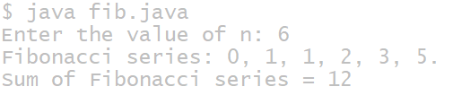

# Additional experiment
## TITLE : Insert a substring into a main string
```
import java.util.Scanner;
public class InsertSubstring {
    public static void main(String[] args) {
        Scanner sc = new Scanner(System.in);
        System.out.print("Enter the main string: ");
        String mainString = sc.nextLine();
        System.out.print("Enter the substring to insert: ");
        String subString = sc.nextLine();
        System.out.print("Enter the position to insert the substring: ");
        int position = sc.nextInt();
        if (position < 0 || position > mainString.length()) {
            System.out.println("Invalid position!");
        } else {
            String firstPart = mainString.substring(0, position);
            String secondPart = mainString.substring(position);
            String resultString = firstPart + subString + secondPart;
            System.out.println("Resulting string: " + resultString);
        }

        sc.close();
    }
}
```
# OUTPUT :
![output of substring}(substring.PNG)
## TITLE : 2.) Display of fibonacci series
```
import java.util.Scanner;
class Fibonacci {
    int sum;
    int n;
    int firstNumber;
    int secondNumber;
    int thirdNumber;
    Fibonacci(int number) {
        n = number;
        firstNumber = 0;
        secondNumber = 1;
        thirdNumber = 0;
        sum = 0;
    }
    void generate() {
       if(n>0)
        System.out.print("Fibonacci series: ");
        while (n > 0) {
            if (n == 1) {
                System.out.println(firstNumber + ".");
                sum = sum + firstNumber;
            } else {
                System.out.print(firstNumber + ", ");
                sum = sum + firstNumber;
            }
            thirdNumber = firstNumber + secondNumber;
            firstNumber = secondNumber;
            secondNumber = thirdNumber;
            n--;
        }

        System.out.println("Sum of Fibonacci series = " + sum);
    }
    public static void main(String[] args) {
        Scanner sc = new Scanner(System.in);
        System.out.print("Enter the value of n: ");
        int number = sc.nextInt();
        Fibonacci f = new Fibonacci(number);
        f.generate();
    }
}
```
# OUTPUT

