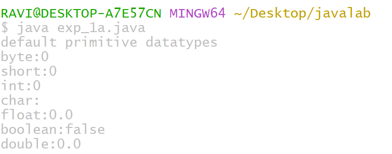

# EXPRIMENT 1
## TITLE : 1b.) Display roots of quaratic equation
```
import java.util.Scanner;
class exp_1b {
   public static void main(String args[]){
    Scanner sc=new Scanner(System.in);
    System.out.print("enter coefficient a:");
    double a=sc.nextDouble();
    System.out.print("enter coefficient b:");
    double b=sc.nextDouble();
    System.out.print("enter coefficient c:");
    double c=sc.nextDouble();
    double discriminant=b*b*-4*a*c;
    if(discriminant >0){
     System.out.println("roots are real and distinct");
     double root1 =(-b+Math.sqrt(discriminant))/(2*a);
     double root2 =(-b-Math.sqrt(discriminant))/(2*a);
     System.out.println("Root1:"+root1);
     System.out.println("Root2:"+root2);
    }
    else if(discriminant==0){
     System.out.println("Roots are real and equal");
     double root=-b/(2*a);
     System.out.println("Root:"+root);
    }
    else {
     System.out.println("Roots are complex and imaginary");
     double realPart=-b/(2*a);
     double imaginaryPart=Math.sqrt(-discriminant)/(2*a);
     System.out.println("Root1:"+realPart+"+"+imaginaryPart+"i");
     System.out.println("Root2:"+realPart+"-"+imaginaryPart+"i");
   }}}


```

# OUTPUT

